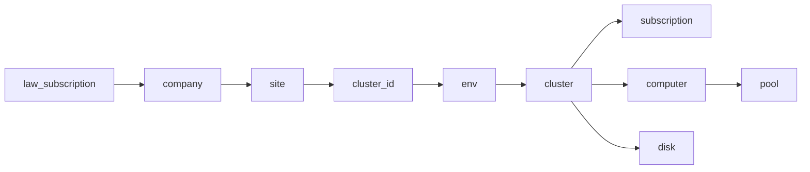

# Grafana Dashboard Variables (Tag-Based)

Dashboard variables follow the tagging hierarchy defined in [tagging-standard.md](tagging-standard.md):

```
Company → Site → ClusterId → Env → Cluster (RG) → Subscription → Physical Node (computer) → Disk / Pool
```

All tag-driven variables query the **central Log Analytics workspace** via the Azure Monitor data source. Node and storage variables scope to the selected cluster resource group.

## Variable summary

| Order | Variable | Label | Type | Depends on | Tag / source |
|-------|----------|-------|------|------------|--------------|
| 1 | `az_monitor` | Azure Monitor | Data source | — | Grafana Azure Monitor plugin |
| 2 | `law_subscription` | LAW Subscription | Azure Subscriptions (hidden) | — | Monitoring sub hosting central LAW |
| 3 | `company` | Company | Log Analytics KQL | — | `tags.Company` |
| 4 | `site` | Site | Log Analytics KQL | `company` | `tags.Site` |
| 5 | `cluster_id` | Cluster ID | Log Analytics KQL | `company`, `site` | `tags.ClusterId` |
| 6 | `env` | Environment | Log Analytics KQL | `company`, `site`, `cluster_id` | `tags.Env` |
| 7 | `cluster` | Cluster | Log Analytics KQL | above | `tags.Cluster` (RG name) |
| 8 | `subscription` | Subscription | Log Analytics KQL | `cluster` | Site `subscriptionId` from Arc machine |
| 9 | `computer` | Physical Node | Log Analytics KQL | `subscription`, `cluster` | SDDC 3000 + Heartbeat |
| 10 | `disk` | Disk | Log Analytics KQL | `subscription`, `cluster` | SDDC 3002 volumes |
| 11 | `pool` | Storage Pool | Log Analytics KQL (hidden) | `subscription`, `cluster`, `computer` | SDDC 3002 pools |

## Architecture flow



`law_subscription` is hidden — set to the monitoring subscription that hosts the central LAW. Tag queries (`company`–`cluster`) run against that workspace context. `subscription` is the **site** subscription resolved from the selected cluster.

## Query files

| Variable | KQL file |
|----------|----------|
| `company` | [`grafana/queries/list_company_query.kql`](../grafana/queries/list_company_query.kql) |
| `site` | [`grafana/queries/list_site_query.kql`](../grafana/queries/list_site_query.kql) |
| `cluster_id` | [`grafana/queries/list_cluster_id_query.kql`](../grafana/queries/list_cluster_id_query.kql) |
| `env` | [`grafana/queries/list_env_query.kql`](../grafana/queries/list_env_query.kql) |
| `cluster` | [`grafana/queries/list_cluster_query.kql`](../grafana/queries/list_cluster_query.kql) |
| `subscription` | [`grafana/queries/list_subscription_query.kql`](../grafana/queries/list_subscription_query.kql) |
| `computer` | [`grafana/queries/list_computer_query.kql`](../grafana/queries/list_computer_query.kql) |
| `disk` | [`grafana/queries/list_disk_query.kql`](../grafana/queries/list_disk_query.kql) |
| `pool` | [`grafana/queries/list_pool_query.kql`](../grafana/queries/list_pool_query.kql) |

Import-ready JSON snippet: [`grafana/dashboard-variables.json`](../grafana/dashboard-variables.json)

## Grafana setup (per variable)

### 1. `az_monitor` — Data source

| Setting | Value |
|---------|-------|
| Type | Data source |
| Name | `az_monitor` |
| Query | `grafana-azure-monitor-datasource` |

Point at the central LAW in the monitoring subscription.

### 2. `law_subscription` — LAW hosting subscription (hidden)

| Setting | Value |
|---------|-------|
| Type | Azure Subscriptions |
| Hide | Variable |
| Default | Monitoring subscription ID (e.g. POC: `5dcf3298-c3a2-4aa6-90d7-8cdd9f6f3563`) |

Used as API context for all `AzureResource` tag queries. Do not confuse with `subscription` (site sub).

### 3–8. Tag hierarchy variables — Azure Log Analytics

Common settings for `company`, `site`, `cluster_id`, `env`, `cluster`, `subscription`:

| Setting | Value |
|---------|-------|
| Data source | `${az_monitor}` |
| Query type | Azure Log Analytics |
| Mode | Raw KQL |
| Subscription | `${law_subscription}` |
| Refresh | On dashboard load |
| Resource scope | `/subscriptions/${law_subscription}` |

**Include All** — enable for `company`, `site`, `cluster_id`, `env` with custom all value `All`.

**Include All** — disable for `cluster` and `subscription` (a cluster must be selected for panels).

Copy KQL from the query files into each variable's query editor.

### 8. `computer` — Physical node

| Setting | Value |
|---------|-------|
| Multi-value | ON |
| Include All | ON |
| Custom all value | `All` |
| Resource scope | `/subscriptions/${subscription}/resourcegroups/${cluster}` |

Uses SDDC EventID 3000 node inventory joined to Heartbeat — no ARM Reader required.

### 9. `disk` — Volume

| Setting | Value |
|---------|-------|
| Multi-value | ON |
| Include All | ON |
| Custom all value | `all` |
| Resource scope | `/subscriptions/${subscription}/resourcegroups/${cluster}` |

### 10. `pool` — Storage pool (hidden)

| Setting | Value |
|---------|-------|
| Hide | Variable |
| Resource scope | `/subscriptions/${subscription}/resourcegroups/${cluster}` |

## Panel resource scope

After selecting the tag hierarchy, panels use:

```
/subscriptions/${subscription}/resourcegroups/${cluster}
```

KQL filter (used in all AZR-208 panels):

```kusto
| where _ResourceId has tolower("/resourcegroups/${cluster}/")
```

Computer filter:

```kusto
| where "${computer}" == "All" or Computer in (${computer:doublequote})
```

## Prerequisites

### Resource tags (Grafana hierarchy variables)

Tag variables use **`arg("").Resources`** (Azure Resource Graph cross-query), **not** a DCR table. Tags are ARM metadata — AMA/DCR cannot collect them.

See [azure-resource-tags-ingestion.md](azure-resource-tags-ingestion.md) for:
- Option A: `arg("").Resources` (recommended, no DCR)
- Option B: Custom `HybridResourceTags_CL` table + ingestion DCR + Automation

**Prerequisites for tag variables**

| Role | Scope |
|------|-------|
| Log Analytics Reader | Central LAW |
| Reader | All site subscriptions (ARG read for `arg()`) |

Verify in LAW:

```kusto
arg("").Resources
| where type =~ "microsoft.hybridcompute/machines"
| where isnotempty(tags.Company)
| take 5
```

### RBAC

| Role | Scope | Variables |
|------|-------|-----------|
| Log Analytics Reader | Central LAW | All KQL variables |
| Reader | Site subscriptions | Optional — ARM fallback only |

See [grafana-rbac.md](grafana-rbac.md).

## POC fallback (no AzureResource)

If `AzureResource` is not yet populated, use static custom variables from [`grafana/poc-tag-mapping.json`](../grafana/poc-tag-mapping.json):

1. Create custom variable `cluster_mapping` (constant JSON or query)
2. Or keep legacy flow: `subscription` (ARM) → `cluster` (ARM Resource Groups) → `computer` (SDDC KQL)

Legacy AZR-208 order (pre-tags):

```
az_monitor → subscription → cluster → computer → disk → pool
```

Migrate to tag hierarchy once Arc machines are tagged and `AzureResource` is available.

## Apply to AZR-208 dashboard

1. Open **AZR-208-Metrics and Logs** → **Settings** → **Variables**
2. Add `company`, `site`, `cluster_id`, `env` above existing `subscription`
3. Replace `cluster` query with [`list_cluster_query.kql`](../grafana/queries/list_cluster_query.kql)
4. Replace `subscription` query with [`list_subscription_query.kql`](../grafana/queries/list_subscription_query.kql) (depends on `cluster`)
5. Update `computer` / `disk` / `pool` from [`grafana/queries/`](../grafana/queries/)
6. Re-order variables per table above
7. Save and test: **CompanyA → SiteA → C1 → Prod → azr-131-itsusra1-delldev01**

Or import [`grafana/dashboard-variables.json`](../grafana/dashboard-variables.json) into a new dashboard and copy the templating block.

## Example selection (architecture diagram)

| Diagram group | Variable values |
|---------------|-----------------|
| Site/Company A C1 | `company=CompanyA`, `site=SiteA`, `cluster_id=C1`, `cluster=azr-131-itsusra1-delldev01` |
| Site/Company A C2 | `company=CompanyA`, `site=SiteA`, `cluster_id=C2`, `cluster=azr-100-companya-c2-rg` |
| Site/Company B C1 | `company=CompanyB`, `site=SiteB`, `cluster_id=C1`, `cluster=azr-200-companyb-c1-rg` |
